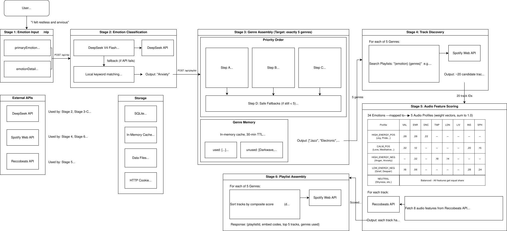

# Freya — Emotion-Driven Music Curation

Freya is a web application that curates personalized Spotify playlists based on emotional analysis. Describe how you feel, and Freya maps your emotional state through Darwin's taxonomy of emotions to a tailored musical landscape.

## Architecture



Single Next.js 16 server — no external backend required.

```
Freya-AI/
  app/                  # Next.js App Router (pages + API routes)
    api/auth/           # Spotify OAuth 2.0 (HMAC-signed state, JWT sessions)
    api/nlp/            # DeepSeek emotion analysis
    api/playlist/       # Playlist creation + recommendations
    api/genres/         # User genre preferences
  src/
    components/         # Shared React components (Navigation)
    hooks/              # React hooks (useAuth)
    lib/                # Server libraries (auth, spotify, emotions, genres, deepseek, db)
    types/              # TypeScript type definitions
  data/                 # SQLite database
```

## Features

- **NLP Emotion Analysis** — Describe how you feel in natural language. DeepSeek AI identifies primary and secondary emotions from Darwin's taxonomy and maps them to audio feature profiles.
- **Smart Genre Matching** — LLM-suggested genres combined with your saved preferences. An intelligent randomization layer prevents taste cocooning.
- **Personalized Spotify Playlists** — Tracks scored against your emotional profile using composite audio feature weighting. Top candidates assembled into a real Spotify playlist.
- **First-Time User Flow** — New users are guided to genre selection before diving into emotion analysis. Returning users go straight to the experience.
- **Natural Design Language** — Scandinavian-minimal aesthetic with custom easing curves and emergent animations.

## Setup

```bash
npm install
```

Create `.env.local`:

```env
SPOTIFY_CLIENT_ID=your_spotify_client_id
SPOTIFY_CLIENT_SECRET=your_spotify_client_secret
SPOTIFY_REDIRECT_URI=http://127.0.0.1:8888/api/auth/callback
DEEPSEEK_API_KEY=your_deepseek_api_key
SESSION_SECRET=your_session_secret_min_32_chars
```

Register `http://127.0.0.1:8888/api/auth/callback` as a redirect URI in your [Spotify Developer Dashboard](https://developer.spotify.com/dashboard).

## Development

```bash
npm run dev     # Start development server at http://127.0.0.1:8888
npm run build   # Production build
npm start       # Start production server at http://127.0.0.1:8888
```

Access the app at `http://127.0.0.1:8888` (or `http://localhost:8888` — the auth flow handles both).

## Tech Stack

- **Framework:** Next.js 16 + React 19
- **Styling:** Tailwind CSS 3.4
- **Auth:** Spotify OAuth 2.0 with HMAC-signed state + encrypted JWT sessions (jose)
- **AI:** DeepSeek for emotion-to-genre mapping
- **Database:** SQLite via better-sqlite3 + Drizzle ORM
- **TypeScript** throughout
